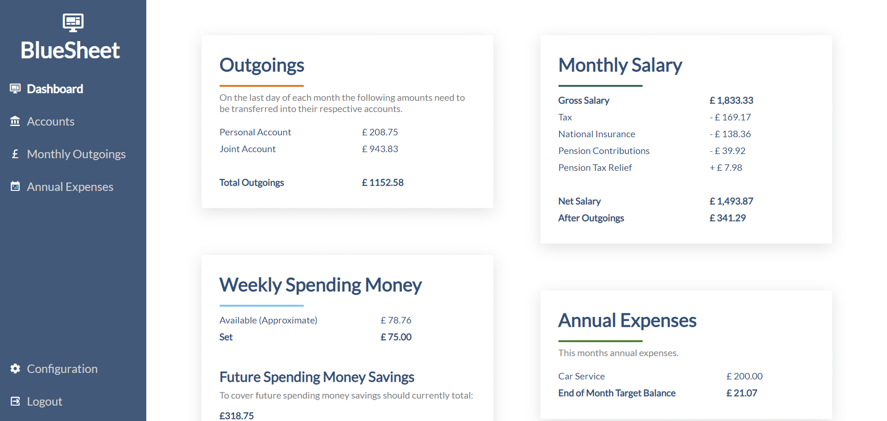
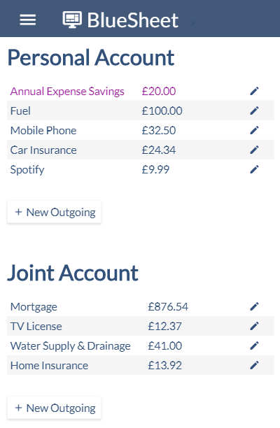

# BlueSheet
A web app to help manage personal finances.




## Introduction
I was looking for a project to improve my (non-existent) HTML and CSS knowledge and so I built this web app to replace a number of spreadsheets I was using to track my own personal finances. It also gave me an opportunity to explore SQL Alchemy and Jinja templating.

It was designed with the following methodology in mind.

1. Salary is paid monthly and not used until the end of the month.
2. On the last day of the month, enough money to cover all monthly outgoings is paid into the account from which they are taken.
3. The remaining balance (expandable income) is saved and then withdrawn weekly (on the same day every week) throughout the month.

## Features
* Track monthly outgoings and ensure enough money is saved to cover them all.
* Record and save for Annual Expenses - Link a monthly outgoing to your annual expenses so that the money is saved and ready when needed.
* Record savings accounts and pensions to get a total of all savings.
* Link an outgoing to a saving to increase the savings account balance by that amount each month.
* Create "self loans" allowing you to borrow from savings and create a re-payment plan.
* Salary Calculation (UK) - Calculate net salary and see tax, NI and pension breakdown.
* Starling Bank Integration - See your main account and savings goal balances on the dashboard.
* Multiple User Support - Multiple users can each have their own password protected set of data.
* Mobile Responsive.

## Change Log
24/02/2019
* Fixed session expiry.

14/03/2019
* Fixed an issue loading existing Weekly Pay Day config.
* Passwords are now hashed before storage.
* Delete warnings now include the name of the item being deleted (for confirmation).

12/04/2019
* Added files required to easily deploy to Heroku.
* Added ability to create a user or change a users password using environment variables (useful for easy Heroku deployment).

## Installation
### Heroku Deployment
The easiest way to run your own version of BlueSheet is to click the button below to deploy it to [Heroku](https://www.heroku.com/). They offer free accounts which have [some limitations](https://www.heroku.com/pricing) but should easily suffice for general use.

[](https://heroku.com/deploy)

Once deployed, to update to the latest verion you can do the following:

1. Download and install [Git](https://git-scm.com/book/en/v2/Getting-Started-Installing-Git) if you don't have it already.
2. Download and install the [Heroku CLI Tool](https://devcenter.heroku.com/articles/heroku-cli#download-and-install) if you don't have it already.
3. Open a terminal / command prompt.
4. Login to Heroku using: `heroku login`
5. Clone your existing deployments source code: `heroku git:clone -a <your app name>` (where "\<your app name>" is what you called BlueSheet on Heroku). *Note: You may get a message to say that you have cloned an empty repository, this is ok.*
6. This will have created a directory with the same name as your app. Nagivate to that directory: `cd <your app name>`
7. Link this repository: `git remote add source https://github.com/Dullage/BlueSheet`
8. Download the latest source code from the linked repo: `git pull source master`
9. Push the latest source code to your app: `git push heroku master`
10. You can now delete the directory that was created if required.


### Other Deployment Options
Alternatively this is a flask python app so can be deployed in [a number of different ways](http://flask.pocoo.org/docs/1.0/deploying/). I personally run this in a [Docker](https://www.docker.com/) container using [Gunicorn](https://gunicorn.org/). This is then served by [Caddy Web Server](https://caddyserver.com/).

The following environment variables need to be set for the app to run:

* SESSION_KEY
* PASSWORD_SALT

Both should be strong passwords. *Note: These will be automatically generated if deploying to Heroku.*

# Admin CLI
bluesheet.py is a command line tool allowing you to add users, unlock user accounts and change passwords.

Alternatively you can also set USERNAME and PASSWORD environment variables. When the app is fist launched, if the declared user already exists the users password will be updated, if not a new user will be created.

## Add a user
```shell
python /path/to/bluesheet.py add-user -u joe.bloggs@example.com -p MyS3curePwd!
```

When the user first logs in they will be taken to the configuration page.

## Unlocking a user account
If a user enters an incorrect password more than 3 times in a row their account will be locked, to unlock an account you can run the following:
```shell
python /path/to/bluesheet.py unlock-user -u joe.bloggs@example.com
```

## Changing a users password
To change a users password you can run the following:
```shell
python /path/to/bluesheet.py change-password -u joe.bloggs@example.com -p My0t4erS3curePwd!
```
