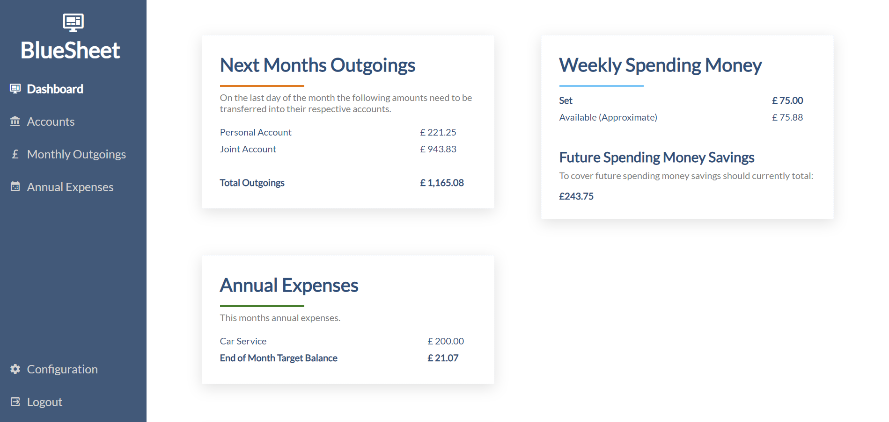

# BlueSheet

A web app to help manage personal finances.




## Introduction

I was looking for a project to improve my (at the time, non-existent) HTML and CSS knowledge and so I built this web app to replace a number of spreadsheets I was using to track my own personal finances. It also gave me an opportunity to explore SQL Alchemy and Jinja templating.

It was designed with the following methodology in mind.

1. Salary is paid monthly and not used until the end of the month.
2. On the last day of the month, enough money to cover all monthly outgoings is paid into the account from which they are taken.
3. The remaining balance (expandable income) is saved and then withdrawn weekly (on the same day every week) throughout the month.

## Features

- Track monthly outgoings and ensure enough money is saved to cover them all.
- Record and save for Annual Expenses - Link a monthly outgoing to your annual expenses so that the money is saved and ready when needed.
- Salary Calculation (UK) - Calculate net salary and see tax, NI and pension breakdown.
- Multiple User Support - Multiple users can each have their own password protected set of data.
- Mobile Responsive.

## Change Log

### 23/05/2021

- Removed Starling Bank integration and Savings functionality. I'd like to completely overhaul this project at some point and so removing the functionality I don't use is a start.
- Removed ids from UI.
- Moved location of "dated outgoing" icon.
- The delete button is no longer hidden on small screens.

To migrate an existing database to be compatible with this release please delete the following database objects:

| Object Type | Object Name                        |
| ----------- | ---------------------------------- |
| Column      | configuration.starling_api_key     |
| Column      | outgoing.linked_saving_id          |
| Column      | outgoing.linked_saving_last_update |
| Column      | outgoing.is_self_loan              |
| Column      | user.next_saving_process_date      |
| Table       | saving                             |

### 15/04/2021

- Removed Herouku deployment option.
- Added Dockerfile.
- Replaced requirements.txt for Pipfile.

### 31/12/2019

- Bumped starlingbank version.

### 18/07/2019

- The "Future Spending Money Savings" total now includes next months savings on the last day of the month. This helps when doing the banking on the last day.

### 23/04/2019

- Removed cryptography dependency. If updating from before this date a password change may be required.

### 12/04/2019

- Added files required to easily deploy to Heroku.
- Added ability to create a user or change a users password using environment variables (useful for easy Heroku deployment).

### 14/03/2019

- Fixed an issue loading existing Weekly Pay Day config.
- Passwords are now hashed before storage.
- Delete warnings now include the name of the item being deleted (for confirmation).

### 24/02/2019

- Fixed session expiry.

## Installation

This is a flask python app so can be deployed in [a number of different ways](http://flask.pocoo.org/docs/1.0/deploying/).

The following environment variables need to be set for the app to run:

- SESSION_KEY
- PASSWORD_SALT

Both should be strong passwords.

You can also optionally set a **DATABASE_URL** environment variable which can be any [SQL Alchemy connection string](https://docs.sqlalchemy.org/en/13/core/engines.html). This will default to `sqlite:///database.db` (a SQLite database stored in a location relative to where the applicant is run) if not specified.

# Admin CLI

bluesheet.py is a command line tool allowing you to add users, unlock user accounts and change passwords.

Alternatively you can also set USERNAME and PASSWORD environment variables. When the app is fist launched, if the declared user already exists the users password will be updated, if not a new user will be created.

## Add a user

```shell
python /path/to/bluesheet.py add-user -u joe.bloggs@example.com -p MyS3curePwd!
```

When the user first logs in they will be taken to the configuration page.

## Unlocking a user account

If a user enters an incorrect password more than 3 times in a row their account will be locked, to unlock an account you can run the following:

```shell
python /path/to/bluesheet.py unlock-user -u joe.bloggs@example.com
```

## Changing a users password

To change a users password you can run the following:

```shell
python /path/to/bluesheet.py change-password -u joe.bloggs@example.com -p My0t4erS3curePwd!
```
